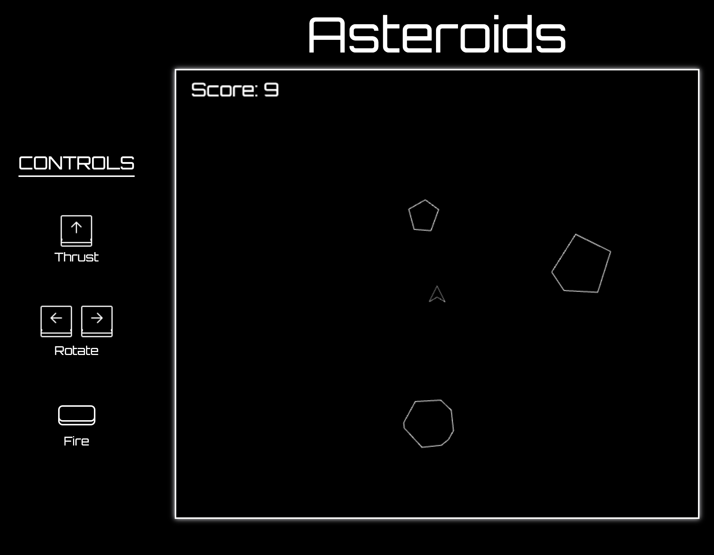

# 🪐 Asteroids Remake

A modern remake of the classic **Asteroids** arcade game, built entirely with vanilla **JavaScript**, **HTML5 Canvas**, and **CSS**. Pilot your ship, avoid and destroy asteroids, and compete for high scores in this browser-based version.



## 🎮 Gameplay Features

- 🛸 **Ship controls** with rotation, thrust, and shooting
- 🪨 **Random asteroid spawning** from all sides
- 💥 **Bullet collision detection** with explosion sounds
- 🧠 **Score increases** with survival time and hits
- 🌌 **Edge-wrapping world** for continuous movement
- 🎨 **Retro UI** and responsive game canvas

## ⌨️ Controls

| Key           | Action        |
|---------------|---------------|
| ⬆️ Arrow Up    | Thrust        |
| ⬅️➡️ Arrows     | Rotate        |
| Spacebar      | Fire Bullet   |

Controls are also visible in the game’s UI panel.

## 🚀 How to Play

1. Clone this repository:
   ```bash
   git clone https://github.com/jjbotto/asteroids.git
2. Navigate to the project directory
3. Open index.html in your browser